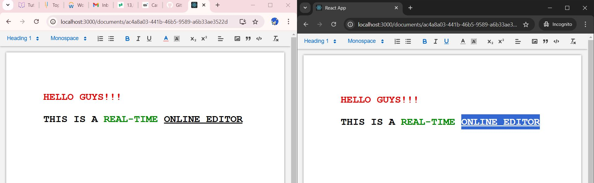

# Real-time Collaborative Document Editor

A real-time collaborative document editor built with React, Socket.IO, and Quill editor. Multiple users can edit documents simultaneously with changes synced in real-time.

## Screenshots


*Real-time document editing interface*

## Features

- Real-time text synchronization
- Rich text editing capabilities
- Multiple document support
- Automatic saving
- Collaborative editing

## Prerequisites

Before you begin, ensure you have installed:
- Node.js (version 14 or higher)
- npm (usually comes with Node.js)
- MongoDB (for document storage)

## Installation

1. Clone the repository
```bash
git clone https://github.com/dhanarajrk/Realtime_Collaborative_Docs_Editor.git
cd Realtime_Collaborative_Docs_Editor
```

2. Install server dependencies
```bash
cd server
npm install
```

3. Install client dependencies
```bash
cd ../client
npm install
```

## Running the Application

1. Start the MongoDB service on your system

2. Start the server
```bash
cd server
npm run devStart
```

3. In a new terminal, start the client
```bash
cd client
npm start
```

The application should now be running on:
- Frontend: http://localhost:3000
- Backend: http://localhost:3001 (default port)

## Environment Variables

Create a `.env` file in the server directory with the following variables:
```env
MONGODB_URI=your_mongodb_connection_string
PORT=3001 (optional)
```
## Technical Stack

### Frontend
- React
- Quill editor
- Socket.IO client
- React Router

### Backend
- Node.js
- Socket.IO
- MongoDB with Mongoose
- Nodemon (development)

## Contributing

1. Fork the repository
2. Create your feature branch (`git checkout -b feature/AmazingFeature`)
3. Commit your changes (`git commit -m 'Add some AmazingFeature'`)
4. Push to the branch (`git push origin feature/AmazingFeature`)
5. Open a Pull Request

## License

This project is licensed under the ISC License. See the LICENSE file for details.

## Contact

Dhanaraj RK - [GitHub](https://github.com/dhanarajrk)

Project Link: [https://github.com/dhanarajrk/Realtime_Collaborative_Docs_Editor](https://github.com/dhanarajrk/Realtime_Collaborative_Docs_Editor)
```

